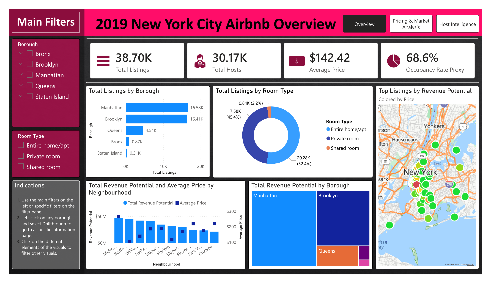

# 2019 New York City Airbnb Data Analysis

## Project Overview
This project provides a comprehensive analysis of the New York City Airbnb market using data from 2019. Developed in Power BI, the report focuses on market distribution, pricing strategies, and host behaviour across the five boroughs. The goal is to identify trends in listing density, revenue potential, and occupancy rates to provide actionable insights into the short-term rental landscape.

## Key Metrics
* **Total Listings:** 38.70K
* **Total Hosts:** 30.17K
* **Average Price:** $142.42
* **Occupancy Rate Proxy:** 68.6%

## Dashboard Structure
The analysis is divided into several specialized views to facilitate data exploration:

* **Market Overview:** A high-level summary of listing counts and revenue potential across NYC.
* **Pricing & Revenue:** An in-depth look at how pricing fluctuates by neighborhood and room type, identifying high-value areas like Midtown.
* **Host Intelligence:** An analysis of host performance and portfolio management, specifically looking at high-volume hosts such as Sonder (NYC).
* **Borough Deep-Dives (Drillthrough Page):** Granular reports for Manhattan, Brooklyn, Queens, the Bronx, and Staten Island, allowing for localized trend analysis.
* **Neighbourhood Spotlight (Drillthrough Page):** Specific information regarding the selected neighbourhood.
* **Host Profile (Drillthrough Page):** Specific information regarding the selected host.

## Overview Page

## Key Insights
* **Borough Distribution:** The market is heavily concentrated in Manhattan (16.58K listings) and Brooklyn (16.41K listings), which together account for the vast majority of the NYC inventory.
* **Revenue Hotspots:** Midtown Manhattan represents the highest revenue potential with an average price of $267.64, significantly outpacing the city-wide average.
* **Room Type Preference:** The market is almost evenly split between **Entire home/apt** (52.4%) and **Private room** (45.4%), while **Shared rooms** represent a negligible fraction (2.2%) of total listings.
* **Host Professionalization:** A significant portion of listings and reviews are managed by professional hosts with multiple properties, indicating a mature, commercialized market in specific Manhattan districts.

## Technical Features
* **Drill-through Functionality:** Users can select a specific borough to navigate to a detailed neighborhood-level analysis.
* **Interactive Filtering:** Dashboards include dynamic filters for room type, price range, and neighborhood groups.
* **Geospatial Mapping:** Visualization of listing density and pricing hotspots using bubble maps centered on NYC coordinates.
* **Custom Tooltips:** Some features have a custom tooltip with valuable information when hovered.

## Tools Used
* **Power BI Desktop:** For data modeling, DAX calculations, and visualization.
* **Dataset:** 2019 New York City Airbnb open data. Access it here[Here](https://www.kaggle.com/datasets/dgomonov/new-york-city-airbnb-open-data).

## How to Use
1. Clone this repository to your local machine.
2. Ensure you have **Power BI Desktop** installed.
3. Open the `.pbip` file to interact with the full report.
4. Use the navigation buttons on the **Overview** page to explore specific host profiles or borough statistics.

---

## Author

Santiago Ortiz

Engineering Physicist | Data Analyst | Data Engineer | Python · SQL · Power BI